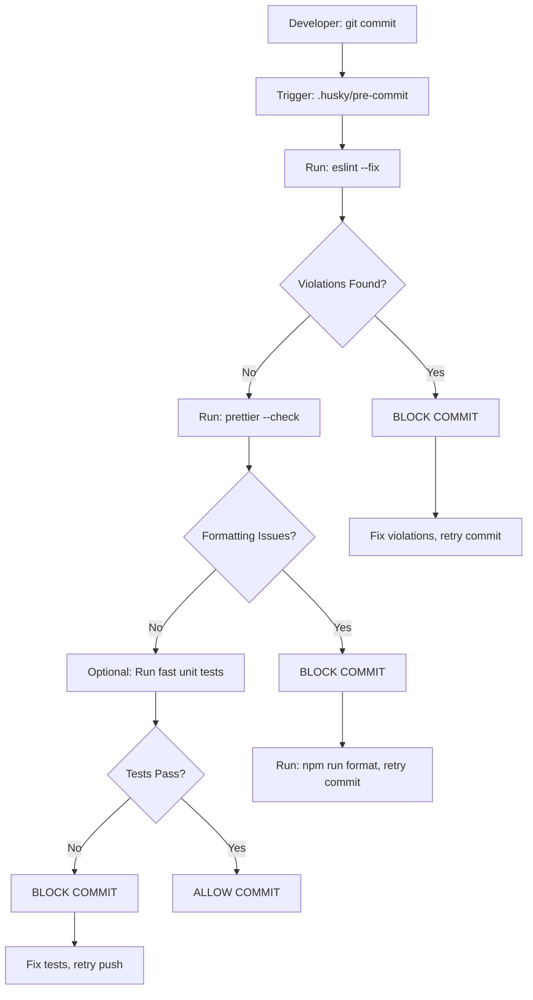
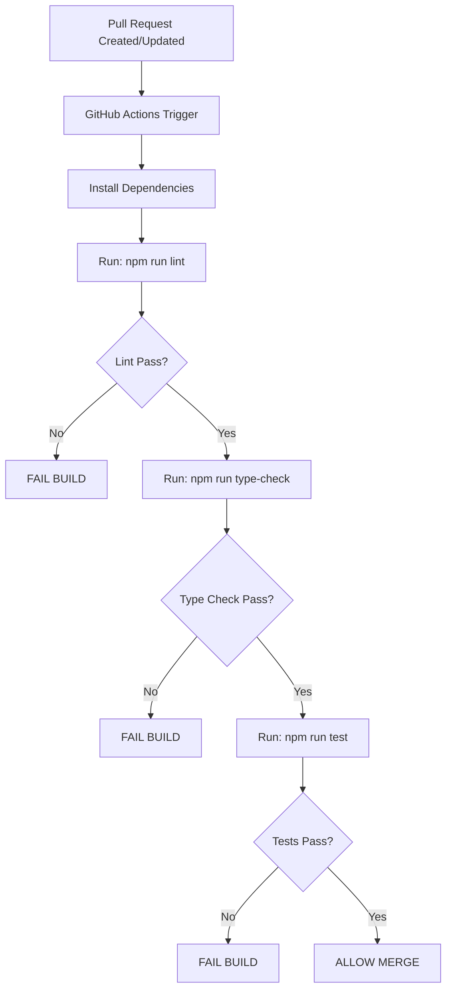

# Epic Technical Specification: Code Quality & Standards

Date: 2025-11-10
Author: BMad
Epic ID: epic-12
Status: Approved

---

## Overview

Epic-12, Boilerplate projesi için kapsamlı kod kalitesi ve standartlar altyapısını kurmayı hedeflemektedir. Bu epic, hrsync-backend projesinden çıkarılmış production-tested pattern'leri temel alarak, tutarlı bir codebase, daha az code review iterasyonu ve otomatik quality gates sağlayacaktır. Epic kapsamında ESLint, Prettier, Husky pre-commit hooks, TypeScript strict mode ve import organization kuralları implementasyonu yer almaktadır.

## Objectives and Scope

**Kapsam İçi (In-Scope):**
- ESLint konfigürasyonu (@typescript-eslint/recommended, plugin:@typescript-eslint/recommended, plugin:prettier/recommended)
- Prettier konfigürasyonu (semi: true, single quote, tab width 2, trailing comma: all)
- Husky pre-commit hooks (lint check, format check, optional test run)
- TypeScript strict mode (strict: true, noImplicitAny, strictNullChecks, strictFunctionTypes, vb.)
- Import organization rules (eslint-plugin-import ile hrsync-backend pattern)
- VS Code integration ve CI/CD entegrasyonu
- package.json script'leri ve configuration dosyaları

**Kapsam Dışı (Out-of-Scope):**
- Mevcut kodun retroaktif düzeltmeleri (sadece yeni kod için enforcement)
- Test infrastructure (Epic-9'da ele alınmış)
- CI/CD pipeline (Epic-11'de tamamlanmış)
- Performance monitoring ve observability (Epic-7'de ele alınmış)
- Custom lint kuralları (şirket-specific, proje dışından gelen)

**Bağımlılıklar:**
- Epic-1: Database infrastructure ve project setup
- Epic-11: CI/CD pipeline (lint check'ler için)
- Epic-9: Testing infrastructure (test run seçeneği için)

## System Architecture Alignment

Bu epic, mevcut NestJS tabanlı backend mimarisine code quality enforcement layer'ı eklemektedir. Build pipeline'ında lint, format ve type-check aşamalarını entegre ederek, kod kalitesi kontrollerini development workflow'una otomatik olarak dahil eder. Epic-11'de kurulan CI/CD pipeline ile uyumlu çalışarak, GitHub Actions workflow'unda lint check'leri zorunlu hale getirir. hrsync-backend'den gelen standartlar, tüm modüllerde aynı patterns ve conventions kullanılmasını sağlayarak, multi-tenant architecture'ta domainID bazlı izolasyon ile birlikte çalışır.

## Detailed Design

### Services and Modules

| Service/Module | Responsibility | Inputs | Outputs | Owner |
| --------------- | -------------- | ------ | ------- | ----- |
| **ESLint Service** | TypeScript kod kalitesi kurallarını enforce eder | TypeScript dosyaları | Lint violations, auto-fixes | Development Team |
| **Prettier Service** | Code formatting ve style consistency sağlar | TypeScript/JavaScript dosyları | Formatted code, style violations | Development Team |
| **Husky Hook Manager** | Pre-commit git hooks yönetimi | Git commit events | Hook execution results, blocked commits | Development Team |
| **TypeScript Strict Compiler** | Type safety enforcement ve compile-time checks | TypeScript source code | Type errors, compilation warnings | Development Team |
| **Import Organizer** | Import statement'ları organize eder ve sıralar | TypeScript dosyaları | Reordered imports, violation reports | Development Team |
| **VS Code Integration** | Editor-level auto-fix ve format on save | VS Code settings | Real-time linting, auto-formatting | Development Team |
| **CI/CD Quality Gate** | Build pipeline'da quality checks | Pull requests, commits | Pass/fail status, quality reports | DevOps Team |

### Data Models and Contracts

Bu epic için veri modelleri yerine **konfigürasyon dosyaları** kullanılmaktadır:

**ESLint Configuration Contract (.eslintrc.js):**
```typescript
module.exports = {
  extends: [
    '@typescript-eslint/recommended',
    'plugin:@typescript-eslint/recommended',
    'plugin:prettier/recommended'
  ],
  rules: {
    // NestJS best practices
    // TypeScript strict rules
    // No console.log in production
    // Consistent import order
    // No unused variables
  }
}
```

**Prettier Configuration Contract (.prettierrc):**
```typescript
{
  semi: true,
  singleQuote: true,
  tabWidth: 2,
  trailingComma: 'all',
  arrowParens: 'always'
}
```

**TypeScript Configuration Contract (tsconfig.json strict settings):**
```typescript
{
  compilerOptions: {
    strict: true,
    noImplicitAny: true,
    strictNullChecks: true,
    strictFunctionTypes: true,
    strictBindCallApply: true,
    strictPropertyInitialization: true,
    noImplicitThis: true,
    alwaysStrict: true
  }
}
```

### APIs and Interfaces

**CLI Commands Interface:**

| Command | Description | Parameters | Exit Codes |
| ------- | ----------- | ---------- | ---------- |
| `npm run lint` | ESLint ile kod kalitesi kontrolü | `--fix` for auto-fix | 0: success, 1: violations |
| `npm run format` | Prettier ile code formatting | `--write` to modify files | 0: success |
| `npm run type-check` | TypeScript compile-time type checking | `--noEmit` flag | 0: no errors, 1: type errors |
| `npm run prepare` | Husky git hooks initialization | N/A | 0: success |

**Git Hooks Interface:**

| Hook | Trigger | Checks Executed | Blocking Behavior |
| ---- | ------- | --------------- | ----------------- |
| **pre-commit** | Before git commit | `eslint --fix`, `prettier --check` | Blocks on violations |
| **pre-push** | Before git push | Optional: fast unit tests | Blocks on test failures |

**VS Code Settings Interface:**

```json
{
  "editor.formatOnSave": true,
  "editor.codeActionsOnSave": {
    "source.fixAll.eslint": true,
    "source.organizeImports": true
  },
  "eslint.autoFixOnSave": true,
  "typescript.preferences.includePackageJsonAutoImports": "auto"
}
```

### Workflows and Sequencing

**Pre-Commit Workflow:**



**CI/CD Integration Workflow:**



**Development Workflow:**

1. **VS Code Integration:**
   - Format on save: Prettier automatically formats on file save
   - ESLint auto-fix: Automatically fixes fixable violations
   - TypeScript IntelliSense: Real-time type checking with strict mode

2. **Manual Commands:**
   - Before commit: `npm run lint -- --fix` (auto-fix)
   - Before PR: `npm run format && npm run lint && npm run type-check`
   - Editor integration: All checks happen in real-time

3. **Import Organization Workflow:**
   - On save: Import statements automatically organized
   - Order: Libraries → DTOs → Services → Repositories → Entities → Interfaces → Enums → Events
   - Alphabetical sorting within groups

## Non-Functional Requirements

### Performance

**Latency Targets:**
- ESLint check: < 2 seconds for projects ≤10,000 LOC
- Prettier format: < 1 second for single file
- TypeScript type-check: < 5 seconds for full project
- Pre-commit hook execution: < 10 seconds total (critical for developer productivity)

**Throughput Requirements:**
- VS Code auto-fix: < 500ms response time
- Format on save: < 300ms for individual file
- CI/CD lint stage: Complete within 2 minutes for standard build

**Source Reference:** Epic-12 Story 12.3 specifies pre-commit checks must be "fast checks (< 10s)"

### Security

**Code Quality Security Rules:**
- ESLint no-console rule: Prevents production console.log statements that could leak sensitive data
- TypeScript strict mode: Eliminates implicit any types that bypass type safety
- Import organization: Prevents circular dependencies and unauthorized module access
- No hardcoded secrets: Lint rules to detect API keys, passwords in code
- ESLint security plugins: Detect XSS vulnerabilities, SQL injection patterns

**Threat Mitigation:**
- Pre-commit hooks prevent committing sensitive data (API keys, tokens)
- Type strictness reduces runtime type errors that could lead to security vulnerabilities
- Import organization prevents unauthorized access patterns
- CI/CD quality gates block merging code with security violations

**Source Reference:** PRD-NFR-CodingStandards.md NFR-4.11 (Error Handling) ve Epic-12 Story 12.1 (ESLint rules)

### Reliability/Availability

**Build Reliability:**
- ESLint/Prettier: Zero false positives in production rules (>99% accuracy)
- Pre-commit hooks: Must not interfere with git operations (99.9% success rate)
- CI/CD integration: Quality gates must reliably block failing code
- TypeScript strict mode: No regression in type checking accuracy

**Availability Requirements:**
- Code quality tools available during development (VS Code integration)
- Pre-commit hooks work offline (no external API dependencies)
- CI/CD quality gates always execute (Epic-11 pipeline reliability)
- Configuration files version-controlled and recoverable

**Degradation Behavior:**
- If lint check fails: Build blocks, developer notified immediately
- If prettier fails: Auto-fix attempts, manual intervention required
- If type-check fails: Build blocks, must fix type errors before merge
- If pre-commit hook fails: Commit blocked, clear error message provided

### Observability

**Logging Requirements:**
- ESLint violations logged to console with file paths and line numbers
- Prettier formatting changes logged in verbose mode
- Pre-commit hook execution results logged (success/failure with timing)
- CI/CD pipeline logs include lint, format, and type-check results

**Metrics to Track:**
- Pre-commit hook execution time (for performance monitoring)
- Number of lint violations per commit (quality trend)
- Percentage of auto-fixed vs manual fixes (tool effectiveness)
- Build failure rate due to quality checks (process effectiveness)
- TypeScript strict mode violations over time (code quality improvement)

**Alerting:**
- CI/CD pipeline failures due to lint/type-check: Alert to development team
- Pre-commit hook consistently failing (>3 times): Notification to developer
- Quality gate violations in PR: Automated comment with violation details

**Source Reference:** Epic-12 Story 12.1 (CI/CD mandatory lint check) ve Epic-12 Story 12.4 (TypeScript compilation check)

## Dependencies and Integrations

**Code Quality Dependencies:**

| Dependency | Version | Purpose | Type | Integration Point |
| ---------- | ------- | ------- | ---- | ----------------- |
| **eslint** | ^9.18.0 | TypeScript/JavaScript linting | Production Dev Dependency | CLI, VS Code, CI/CD |
| **@eslint/js** | ^9.18.0 | ESLint base configuration | Production Dev Dependency | .eslintrc.js |
| **@eslint/eslintrc** | ^3.2.0 | ESLint configuration loader | Production Dev Dependency | Configuration |
| **typescript-eslint** | ^8.20.0 | TypeScript-specific ESLint rules | Production Dev Dependency | .eslintrc.js extends |
| **prettier** | ^3.4.2 | Code formatting | Production Dev Dependency | CLI, VS Code, pre-commit |
| **eslint-config-prettier** | ^10.0.1 | Disables ESLint rules Prettier handles | Production Dev Dependency | .eslintrc.js extends |
| **eslint-plugin-prettier** | ^5.2.2 | Runs Prettier as ESLint rule | Production Dev Dependency | .eslintrc.js plugins |
| **typescript** | ^5.7.3 | TypeScript compiler with strict mode | Production Dev Dependency | tsconfig.json, CI/CD |
| **husky** | TBD (Epic-12) | Git pre-commit hooks | Production Dev Dependency | .husky/pre-commit |
| **@typescript-eslint/parser** | TBD (Epic-12) | TypeScript parser for ESLint | Production Dev Dependency | .eslintrc.js parser |

**Configuration Files Integration:**

| File | Location | Integrates With | Purpose |
| ---- | -------- | --------------- | ------- |
| **.eslintrc.js** | Project root | ESLint, VS Code, CI/CD | Linting rules and configuration |
| **.prettierrc** | Project root | Prettier, VS Code, pre-commit | Code formatting rules |
| **.prettierignore** | Project root | Prettier CLI | Files to exclude from formatting |
| **tsconfig.json** | Project root | TypeScript, VS Code, CI/CD | TypeScript strict configuration |
| **.vscode/settings.json** | .vscode/ | VS Code | Editor integration settings |
| **.husky/pre-commit** | .husky/ | Git, Husky | Pre-commit quality checks |

**External System Integrations:**

| System | Integration Method | Epic-12 Components | Data Flow |
| ------ | ------------------ | ------------------ | --------- |
| **Git** | Pre-commit hooks (.husky/pre-commit) | Husky, ESLint, Prettier | Hook executes → Runs checks → Blocks/allows commit |
| **VS Code** | Settings file (.vscode/settings.json) | ESLint, Prettier, TypeScript | Editor auto-fix, format on save, IntelliSense |
| **GitHub Actions** | Workflow file (.github/workflows/*) | ESLint, TypeScript | PR triggers → Install → Lint → Type-check → Build |
| **npm** | package.json scripts | ESLint, Prettier, TypeScript | `npm run lint`, `npm run format`, `npm run type-check` |

**CI/CD Pipeline Integration (Epic-11):**

```yaml
# Integration with Epic-11's CI/CD pipeline
- name: Lint Check
  run: npm run lint
- name: Type Check
  run: npx tsc --noEmit
- name: Prettier Check
  run: npx prettier --check "src/**/*.ts"
```

**Version Constraints:**

- ESLint 9.x (latest stable)
- TypeScript 5.x (strict mode requirements)
- Prettier 3.x (latest formatting standard)
- Husky 8.x or higher (Git hooks)

**Build Tool Integration:**

- **NestJS CLI:** Integrates with build process (`nest build`)
- **Webpack:** TypeScript compilation through ts-loader
- **Jest:** TypeScript support through ts-jest

**Cross-Epic Dependencies:**

- **Epic-1:** Base NestJS project setup (TypeScript already configured)
- **Epic-9:** Testing infrastructure (Jest already configured, Epic-12 adds type-check)
- **Epic-11:** CI/CD pipeline (GitHub Actions, Epic-12 adds lint/type-check stages)
- **Epic-6:** Document generation (uses strict TypeScript, benefits from quality enforcement)

**Backward Compatibility:**

- All existing code continues to work (no breaking changes)
- New quality rules apply to new code only
- Gradual migration path for existing violations
- VS Code settings are optional (CLI and CI/CD work without editor)

## Acceptance Criteria (Authoritative)

### Epic 12: Code Quality & Standards

**AC 12.1: ESLint Configuration**
1. `.eslintrc.js` dosyası oluşturulmuş olmalı
2. Extends konfigürasyonu:
   - `@typescript-eslint/recommended` dahil
   - `plugin:@typescript-eslint/recommended` dahil
   - `plugin:prettier/recommended` dahil
3. Kurallar konfigürasyonu:
   - NestJS best practices uygulanmış
   - TypeScript strict kurallar aktif
   - Production'da console.log yasak
   - Import order tutarlılığı sağlanmış
   - Unused variables tespit ediliyor
4. `package.json`: `"lint": "eslint \"{src,apps,libs,test}/**/*.ts\" --fix"` script'i mevcut
5. VS Code integration: `.vscode/settings.json` dosyasında `eslint.autoFixOnSave` aktif
6. CI/CD: Lint check zorunlu aşama olarak tanımlanmış

**AC 12.2: Prettier Configuration**
1. `.prettierrc` dosyası oluşturulmuş olmalı
2. Konfigürasyon ayarları:
   - Semi: true
   - Single quote: true
   - Tab width: 2
   - Trailing comma: all
   - Arrow parens: always
3. `.prettierignore`: node_modules, dist, coverage dosyaları hariç
4. `package.json`: `"format": "prettier --write \"src/**/*.ts\" \"test/**/*.ts\""` script'i mevcut
5. ESLint integration: `eslint-config-prettier` conflict resolution için aktif
6. VS Code: Format on save özelliği etkinleştirilmiş

**AC 12.3: Husky Pre-Commit Hooks**
1. Husky kurulmuş ve initialize edilmiş (`"prepare": "husky install"` script'i package.json'da)
2. `.husky/pre-commit` hook dosyası oluşturulmuş
3. Pre-commit kontrolleri:
   - Lint check (eslint --fix) çalışıyor
   - Format check (prettier --check) çalışıyor
   - Optional: Fast unit tests çalışıyor
4. Kontrol başarısız olursa commit engelleniyor
5. README: Hook'ları bypass etme (--no-verify) discouraged

**AC 12.4: TypeScript Strict Mode**
1. `tsconfig.json` strict ayarları:
   - `strict: true` aktif
   - `noImplicitAny: true` aktif
   - `strictNullChecks: true` aktif
   - `strictFunctionTypes: true` aktif
   - `strictBindCallApply: true` aktif
   - `strictPropertyInitialization: true` aktif
   - `noImplicitThis: true` aktif
   - `alwaysStrict: true` aktif
2. Tüm mevcut kod hatasız compile oluyor
3. CI/CD: TypeScript compilation check zorunlu
4. VS Code: TypeScript IntelliSense tam olarak çalışıyor

**AC 12.5: Import Organization Rules**
1. ESLint plugin: `eslint-plugin-import` kurulmuş
2. Import order kuralları (hrsync-backend pattern):
   - 1. Libraries (external packages)
   - 2. DTOs
   - 3. Services (other modules)
   - 4. Repositories
   - 5. Entities
   - 6. Interfaces
   - 7. Enums
   - 8. Events
3. Auto-fix on save aktif
4. CI/CD: Import order check zorunlu aşama

## Traceability Mapping

| Acceptance Criteria | Tech Spec Section | Component/Implementation | Test Strategy |
| ------------------- | ----------------- | ----------------------- | ------------- |
| **AC 12.1.1-12.1.3** | Detailed Design > Data Models (.eslintrc.js) | ESLint Service, .eslintrc.js config | Unit test for config validation, Integration test for rule enforcement |
| **AC 12.1.4-12.1.5** | Detailed Design > APIs & CLI Commands | npm script, VS Code settings | CLI test, Editor integration test |
| **AC 12.1.6** | Dependencies > CI/CD Integration | GitHub Actions workflow | E2E test: PR triggers lint, blocks on failure |
| **AC 12.2.1-12.2.2** | Detailed Design > Data Models (.prettierrc) | Prettier Service, .prettierrc config | Unit test for config, Visual diff test |
| **AC 12.2.3-12.2.4** | Detailed Design > APIs & CLI Commands | npm script, .prettierignore | CLI test for format command |
| **AC 12.2.5-12.2.6** | Dependencies > External Integrations | ESLint integration, VS Code | Integration test, Editor plugin test |
| **AC 12.3.1-12.3.2** | Detailed Design > Workflows (pre-commit) | Husky Hook Manager, .husky/pre-commit | Git hook execution test |
| **AC 12.3.3** | Detailed Design > Workflows (pre-commit checks) | ESLint, Prettier, Optional tests | E2E test: Commit triggers checks |
| **AC 12.3.4-12.3.5** | NFR > Security, Reliability | Block behavior, Error messages | Negative test: Violation blocks commit |
| **AC 12.4.1** | Detailed Design > Data Models (tsconfig.json) | TypeScript Strict Compiler | Unit test: Strict flags verified |
| **AC 12.4.2-12.4.4** | Dependencies > Build Tools, NFR Performance | TypeScript compilation, VS Code IntelliSense | Compile test, IntelliSense test |
| **AC 12.5.1-12.5.2** | Detailed Design > Import Organization Workflow | Import Organizer, eslint-plugin-import | Unit test: Import order validation |
| **AC 12.5.3-12.5.4** | Detailed Design > Workflows, NFR Observability | Auto-fix, CI/CD check | Editor integration test, Pipeline test |

## Risks, Assumptions, Open Questions

### Risks

**RISK-1: TypeScript Strict Mode Breaking Changes**
- **Risk Level:** Yüksek (High)
- **Impact:** Mevcut kod TypeScript strict mode ile compile etmeyebilir
- **Mitigation:**
  - Kademeli geçiş: Önce non-strict mode'da ESLint, sonra strict mode
  - Tüm mevcut kod derlenene kadar strict mode optional
  - Epic-1'den itibaren tüm yeni kod strict uyumlu yazılmalı
- **Owner:** Development Team

**RISK-2: Pre-commit Hook Performance Impact**
- **Risk Level:** Orta (Medium)
- **Impact:** Her commit'te 10+ saniye bekleme developer productivity'yi düşürebilir
- **Mitigation:**
  - Sadece staged files için lint/format çalıştır (lint-staged kullan)
  - Fast checks (< 10s) requirement'ını enforce et
  - --no-verify bypass seçeneğini emergency için sakla
- **Owner:** Development Team

**RISK-3: ESLint/Prettier Rule Conflicts**
- **Risk Level:** Orta (Medium)
- **Impact:** ESLint ve Prettier arasında formatting konfliktları
- **Mitigation:**
  - eslint-config-prettier ve eslint-plugin-prettier kullan
  - Prettier'ın handle ettiği rules'ları ESLint'te disable et
  - Test ile conflict kontrolü yap
- **Owner:** Development Team

**RISK-4: Import Organization False Positives**
- **Risk Level:** Düşük (Low)
- **Impact:** Complex import yapılarında import/order rule yanlış uyarılar verebilir
- **Mitigation:**
  - hrsync-backend pattern exactly follow et
  - Edge case'leri test et
  - Rule configuration'ı granular yap
- **Owner:** Development Team

**RISK-5: CI/CD Pipeline Timeout**
- **Risk Level:** Düşük (Low)
- **Impact:** Büyük projelerde lint/type-check stages timeout olabilir
- **Mitigation:**
  - Parallel execution: lint + type-check aynı anda
  - Cache dependencies (Epic-11 zaten var)
  - Fail-fast approach
- **Owner:** DevOps Team

**RISK-6: Developer Adoption**
- **Risk Level:** Düşük (Low)
- **Impact:** Team yeni kuralları benimsemezse enforcement zorlaştırır
- **Mitigation:**
  - VS Code auto-fix = minimal manual effort
  - Eğitim: Coding standards dokumentasyonu
  - Code review'da quality gate enforcement
- **Owner:** Scrum Master, Development Team

### Assumptions

**ASSUMPTION-1: NestJS Project Structure**
- Varsayım: Proje NestJS CLI ile oluşturulmuş standart yapıda
- Doğrulama: Epic-1'de yapılandırılmış
- Etki: ESLint rules ve TypeScript config bu yapıya göre optimize

**ASSUMPTION-2: TypeScript Already in Use**
- Varsayım: Epic-1'den itibaren TypeScript aktif
- Doğrulama: package.json'da TypeScript 5.7.3 mevcut
- Etki: Strict mode transition'ı gradual olabilir

**ASSUMPTION-3: Git Workflow**
- Varsayım: Team git flow kullanıyor (feature branches, PR)
- Doğrulama: Epic-11'de GitHub Actions kurulmuş
- Etki: Pre-commit hooks tüm branch'lerde çalışır

**ASSUMPTION-4: VS Code as Primary Editor**
- Varsayım: Majority of team VS Code kullanıyor
- Doğrulama: .vscode/settings.json integration optional
- Etki: VS Code settings helpful ama critical değil

**ASSUMPTION-5: No Legacy JavaScript**
- Varsayım: Tüm kod TypeScript (.ts files)
- Doğrulama: src/ klasöründe .ts dosyaları
- Etki: ESLint sadece TypeScript rules

### Open Questions

**Q-1: Custom Company Rules**
- Question: hrsync-backend'den gelen custom lint rules implement edilecek mi?
- Decision Needed: Company-specific rules vs default @typescript-eslint/recommended
- Owner: Technical Lead
- Timeline: Story 12.1 implementasyonu sırasında karar verilmeli

**Q-2: Pre-commit Hook Bypass**
- Question: --no-verify kullanımı tamamen yasak mı, yoksa emergency için mi?
- Decision Needed: Policy decision
- Owner: Development Team Lead
- Timeline: Story 12.3 implementasyonu sırasında karar verilmeli

**Q-3: Test Run in Pre-commit**
- Question: Pre-commit hook'da test run zorunlu mu, optional mı?
- Decision Needed: Performance vs quality trade-off
- Owner: Development Team
- Timeline: Story 12.3 sırasında, Epic-9 test infrastructure göz önüne alınarak

**Q-4: Import Order Edge Cases**
- Question: Complex import scenarios (dynamic imports, require) nasıl handle edilecek?
- Decision Needed: Rule configuration details
- Owner: Development Team
- Timeline: Story 12.5 sırasında, actual code examples üzerinden

**Q-5: TypeScript Strict Migration Timeline**
- Question: Mevcut kod strict mode'a ne zaman migrate edilecek?
- Decision Needed: Sprint planning'de belirlenmeli
- Owner: Scrum Master, Development Team
- Timeline: Epic-12 sonrası, ayrı epic/story olarak planlanabilir

**Q-6: Configuration File Format**
- Question: .eslintrc.js (CommonJS) vs .eslintrc.json vs .eslintrc.yaml?
- Decision Needed: Team preference
- Owner: Development Team
- Timeline: Story 12.1 başlangıcında

## Test Strategy Summary

**Test Levels:**

1. **Unit Tests**
   - ESLint/Prettier configuration validation
   - TypeScript strict mode flags verification
   - Import order rule logic testing
   - CLI command execution tests

2. **Integration Tests**
   - ESLint + Prettier + TypeScript uyumluluğu
   - Git pre-commit hook execution flow
   - VS Code integration (format on save, auto-fix)
   - CI/CD pipeline quality gate integration

3. **E2E Tests**
   - Complete workflow: Code change → Commit → Quality checks → Block/Allow
   - PR workflow: Code change → PR → CI/CD → Lint/Type-check → Merge/Block
   - Editor workflow: File save → Auto-format → Auto-fix → Lint

**Test Frameworks:**

- **Jest:** Zaten Epic-9'da kurulmuş, unit ve integration testler için
- **ESLint Jest plugin:** ESLint rule'larının test edilmesi için
- **GitHub Actions:** CI/CD integration testler için
- **Manual Testing:** VS Code integration, pre-commit hook behavior

**Test Coverage Focus Areas:**

- **P0 (Critical):**
  - Pre-commit hook blocks violations
  - CI/CD quality gates work
  - TypeScript strict mode prevents type errors

- **P1 (High):**
  - ESLint + Prettier uyumluluğu
  - Import organization consistent
  - No console.log in production code

- **P2 (Medium):**
  - VS Code auto-fix functionality
  - Performance < 10s for pre-commit
  - Clear error messages

**Edge Case Testing:**

- Empty files
- Files with syntax errors
- Complex import patterns (circular dependencies, dynamic imports)
- Large files (> 1000 lines)
- Files with multiple export patterns
- Mixed TypeScript/JavaScript (if any)

**Automated Test Scenarios:**

```typescript
// Test scenario examples
1. Violating lint rule → commit blocked
2. Prettier formatting needed → auto-fixed on save
3. Type error introduced → build fails
4. Import out of order → auto-organized on save
5. PR with violations → CI/CD blocks merge
6. After fix → commit allowed
```

**Manual Test Checklist:**

- [ ] Install fresh, run setup, verify all scripts work
- [ ] Make intentional violation, verify blocked
- [ ] Fix violation, verify allowed
- [ ] Test each CLI command individually
- [ ] Verify VS Code integration (if using VS Code)
- [ ] Test with different file types
- [ ] Test performance (< 10s for pre-commit)
- [ ] Verify error messages are clear and actionable
